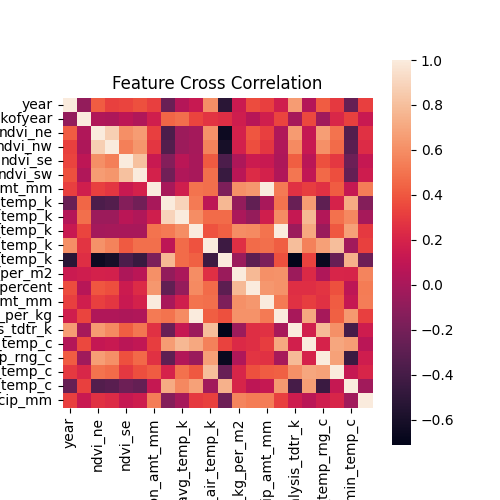

# dengai-undisease
Predicting against the damn mosquitos
https://www.drivendata.org/competitions/44/dengai-predicting-disease-spread/page/82/

## Prelude
## Making a cosy work environment
i.e. moving the desks around so we can be next to each other

## How do we want to work together?
Quick iterative process

## Defining strategy

### Day 1
- Define what kind of problem we're dealing with
- Data cleaning
    - columns analyzed to get sense of robustness
    - cleaning ideas
- Data visualization
- Develop pipeline 
 - Cleaning
 - Transformation / encoding
 - Model Training 
 - Model Fitting
- Baseline models ready and scored

### Day 2
- Feature engineering
- Model Tweaking

### Day 3
- Last tweaking
- Preparing presentation

for more check `plan.md`

## What do we know?

## Lots of redundant Variables

## Our model

- `evaluate.py` > main
    - `best_pipeline`
        - random forest regressor
    - `utils.py` 
        - loading traces
    - `cleaning` 
        - PNN filling
        - drop nans values when > 4 in a row
        - removing outliers (when target > 5 x mean)
    - `visu` > awesome plots

## Our prediction

`dengue_preds_15_00_37.csv` > score: MAE = 24.75 on DRIVENDATA

# TO DO 
 - rolling average to fix
 - oversampling